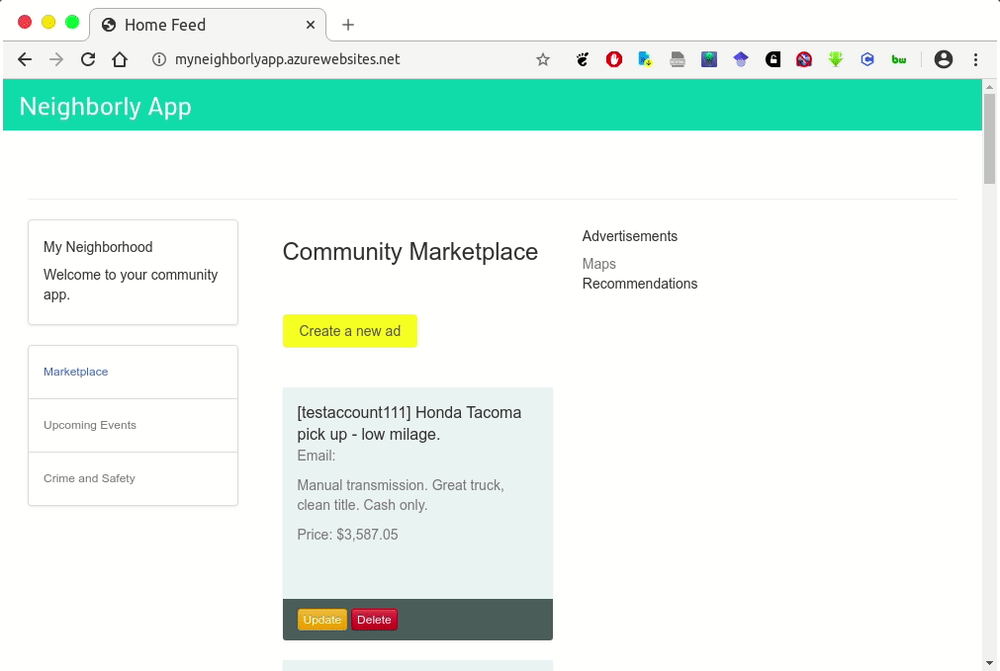
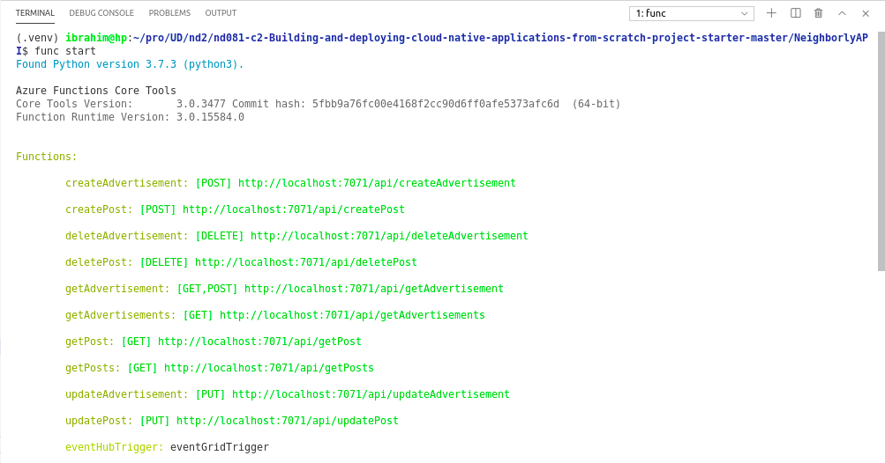

# Deploying the Neighborly App with Azure Functions

## Project Overview
Building and deploying cloud native applications:

In this project, we are going to build an app called "Neighborly" using microservice architecture. Microservices are an architectural approach to building applications where each core function, or service, is built and deployed independently.

Neighborly is a Python Flask-powered web application that allows neighbors to post advertisements for services and products they can offer.
The project is comprised of a front-end application that is built with the Python Flask micro framework. It allows the user to view, create, edit, and delete the community advertisements.

The application makes direct requests to the back-end API endpoints.

You can see an example of the deployed app below.



## Dependencies

You will need to install the following locally:

- [Pipenv](https://pypi.org/project/pipenv/)
- [Visual Studio Code](https://code.visualstudio.com/download)
- [Azure Function tools V3](https://docs.microsoft.com/en-us/azure/azure-functions/functions-run-local?tabs=windows%2Ccsharp%2Cbash#install-the-azure-functions-core-tools)
- [Azure CLI](https://docs.microsoft.com/en-us/cli/azure/install-azure-cli?view=azure-cli-latest)
- [Azure Tools for Visual Studio Code](https://marketplace.visualstudio.com/items?itemName=ms-vscode.vscode-node-azure-pack)

On Mac, you can do this with:

```bash
# install pipenv
brew install pipenv

# install azure-cli
brew update && brew install azure-cli

# install azure function core tools 
brew tap azure/functions
brew install azure-functions-core-tools@3
```

## Project Instructions

In case you need to return to the project later on, it is suggested to store any commands you use so you can re-create your work.

### I. Creating Azure Function App [x]

We need to set up the Azure resource group, region, storage account, and an app name before we can publish.

1. Create a resource group.
2. Create a storage account (within the previously created resource group and region).
3. Create an Azure Function App within the resource group, region and storage account. 
   - Note that app names need to be unique across all of Azure.
   - Make sure it is a Linux app, with a Python runtime.

    Example of successful output, if creating the app `myneighborlyapiv1`:

    ```bash
    Your Linux function app 'myneighborlyapiv1', that uses a consumption plan has been successfully created but is not active until content is published using Azure Portal or the Functions Core Tools.
    ```

4. Set up a Cosmos DB Account. You will need to use the same resource group, region and storage account, but can name the Cosmos DB account as you prefer. **Note:** This step may take a little while to complete (15-20 minutes in some cases).

5. Create a MongoDB Database in CosmosDB Azure and two collections, one for `advertisements` and one for `posts`.
6. Print out your connection string or get it from the Azure Portal. Copy/paste the **primary connection** string.  You will use it later in the application.

    Example connection string output:
    ```bash
    bash-3.2$ Listing connection strings from COSMOS_ACCOUNT:
    + az cosmosdb keys list -n neighborlycosmos -g neighborlyapp --type connection-strings
    {
    "connectionStrings": [
        {
        "connectionString": "AccountEndpoint=https://neighborlycosmos.documents.azure.com:443/;AccountKey=xxxxxxxxxxxx;",
        "description": "Primary SQL Connection String"
        },
        {
        "connectionString": "AccountEndpoint=https://neighborlycosmos.documents.azure.com:443/;AccountKey=xxxxxxxxxxxxx;",
        "description": "Secondary SQL Connection String"
        } 
        
        ... [other code omitted]
    ]
    }
    ```

7. Import Sample Data Into MongoDB.
   - Download dependencies:
        ```bash
        # get the mongodb library
        brew install mongodb-community@4.2

        # check if mongoimport lib exists
        mongoimport --version
        ```

    - Import the data from the `sample_data` directory for Ads and Posts to initially fill your app.
    - You can also use the VS Code extension for Azure CosmosDB to create and import the database

        Example successful import using the terminal:
        ```
        Importing ads data ------------------->
        2020-05-18T23:30:39.018-0400  connected to: mongodb://neighborlyapp.mongo.cosmos.azure.com:10255/
        2020-05-18T23:30:40.344-0400  5 document(s) imported successfully. 0 document(s) failed to import.
        ...
        Importing posts data ------------------->
        2020-05-18T23:30:40.933-0400  connected to: mongodb://neighborlyapp.mongo.cosmos.azure.com:10255/
        2020-05-18T23:30:42.260-0400  4 document(s) imported successfully. 0 document(s) failed to import.
        ```
    
8. Hook up your connection string into the NeighborlyAPI server folder. You will need to replace the *url* variable with your own connection string you copy-and-pasted in the last step, along with some additional information.
    - Tip: Check out [this post](https://docs.microsoft.com/en-us/azure/cosmos-db/connect-mongodb-account) if you need help with what information is needed.
    - Go to each of the `__init__.py` files in getPosts, getPost, getAdvertisements, getAdvertisement, deleteAdvertisement, updateAdvertisement, createAdvertisements and replace your connection string. You will also need to set the related `database` and `collection` appropriately.

    ```bash
    # inside getAdvertisements/__init__.py

    def main(req: func.HttpRequest) -> func.HttpResponse:
        logging.info('Python getAdvertisements trigger function processed a request.')

        try:
            # copy/paste your primary connection url here
            # or save them in function app settings: variable "MyMongoDB_conn"
            #-------------------------------------------
            #url = "localhost"
            url = os.environ['MyMongoDB_conn']
            #--------------------------------------------

            client=pymongo.MongoClient(url)

            database = client['azure'] # Feed the correct key for the database name to the client
            collection = client['advertisements'] # Feed the correct key for the collection name to the database

            ... [other code omitted]
            
    ```

    Make sure to do the same step for the other 9 HTTP Trigger functions.

9. Deploy your Azure Functions.

    1. Test it out locally first.

        ```bash
        # cd into NeighborlyAPI
        cd NeighborlyAPI

        # install dependencies
        pipenv install

        # go into the shell
        pipenv shell

        # test func locally
        func start
        ```

        You may need to change `"IsEncrypted"` to `false` in `local.settings.json` if this fails.

        At this point, Azure functions are hosted in localhost:7071.  You can use the browser or Postman to see if the GET request works.  For example, go to the browser and type in: 

        ```bash
        # example endpoint for all advertisements
        http://localhost:7071/api/getadvertisements

        #example endpoint for all posts
        http://localhost:7071/api/getposts
        ```

    2. Now you can deploy functions to Azure by publishing your function app.

        The result may give you a live url in this format, or you can check in Azure portal for these as well:

        Expected output if deployed successfully:
        ```bash
        Functions in igneighborly:
            createAdvertisement - [httpTrigger]
                Invoke url: https://igneighborly.azurewebsites.net/api/createadvertisement

            createPost - [httpTrigger]
                Invoke url: https://igneighborly.azurewebsites.net/api/createaPost

            deleteAdvertisement - [httpTrigger]
                Invoke url: https://igneighborly.azurewebsites.net/api/deleteadvertisement
            
            deletePost - [httpTrigger]
                Invoke url: https://igneighborly.azurewebsites.net/api/deletePost

            getAdvertisement - [httpTrigger]
                Invoke url: https://igneighborly.azurewebsites.net/api/getadvertisement

            getAdvertisements - [httpTrigger]
                Invoke url: https://igneighborly.azurewebsites.net/api/getadvertisements

            getPost - [httpTrigger]
                Invoke url: https://igneighborly.azurewebsites.net/api/getpost

            getPosts - [httpTrigger]
                Invoke url: https://igneighborly.azurewebsites.net/api/getposts

            updateAdvertisement - [httpTrigger]
                Invoke url: https://igneighborly.azurewebsites.net/api/updateadvertisement

            updatePost - [httpTrigger]
                Invoke url: https://igneighborly.azurewebsites.net/api/updatePost
        ```

        Example of functions running in localhost
        
        
        Deployed functions on azure

        
        **Note:** It may take a minute or two for the endpoints to get up and running if you visit the URLs.

        Save the function app url **https://igneighborly.azurewebsites.net/api/** since you will need to update that in the client-side of the application.

### II. Deploying the client-side Flask web application [x]

We are going to update the Client-side `settings.py` with published API endpoints. First navigate to the `settings.py` file in the NeighborlyFrontEnd/ directory.

Use a text editor to update the API_URL to your published url from the last step.
```bash
# Inside file settings.py

# ------- For Local Testing -------
#API_URL = "http://localhost:7071/api"

# ------- For production -------
# where APP_NAME is your Azure Function App name 
API_URL="https://igneighborly.azurewebsites.net/api"
```

### III. CI/CD Deployment [x]

1. Deploy your client app. **Note:** Use a **different** app name here to deploy the front-end, or else you will erase your API. From within the `NeighborlyFrontEnd` directory:
    - Install dependencies with `pipenv install`
    - Go into the pip env shell with `pipenv shell`
    - Deploy your application to the app service. **Note:** It may take a minute or two for the front-end to get up and running if you visit the related URL.

    Make sure to also provide any necessary information in `settings.py` to move from localhost to your deployment.

    App link: https://myneighborlyapp.azurewebsites.net/
    

2. Create an Azure Registry and dockerize your Azure Functions. Then, push the container to the Azure Container Registry.


3. Create a Kubernetes cluster, and verify your connection to it with `kubectl get nodes`.
4. Deploy app to Kubernetes, and check your deployment with `kubectl config get-contexts`.


### IV. Event Hubs and Logic App [x]

1. Create a Logic App that watches for an HTTP trigger. When the HTTP request is triggered, send yourself an email notification.

2. Create a namespace for event hub in the portal. You should be able to obtain the namespace URL.

3. Add the connection string of the event hub to the Azure Function.

### V.  Cleaning Up Your Services [x]

Before completing this step, make sure to have taken all necessary screenshots for the project! Check the rubric in the classroom to confirm.

Clean up and remove all services, or else you will incur charges.

```bash
# replace with your resource group
RESOURCE_GROUP="project2"
# run this command
az group delete --name $RESOURCE_GROUP
```
